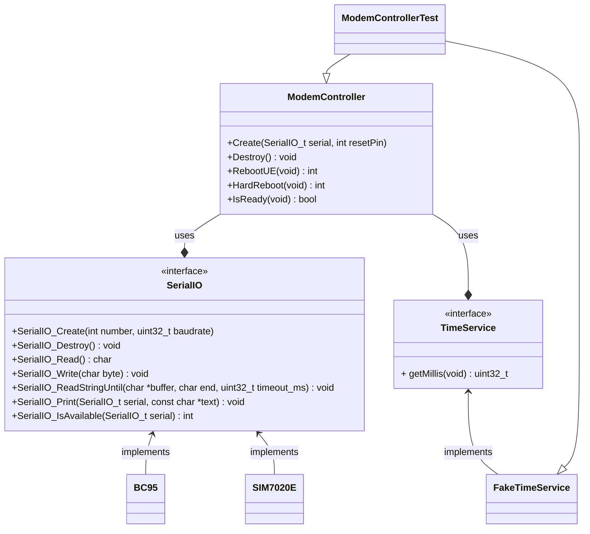
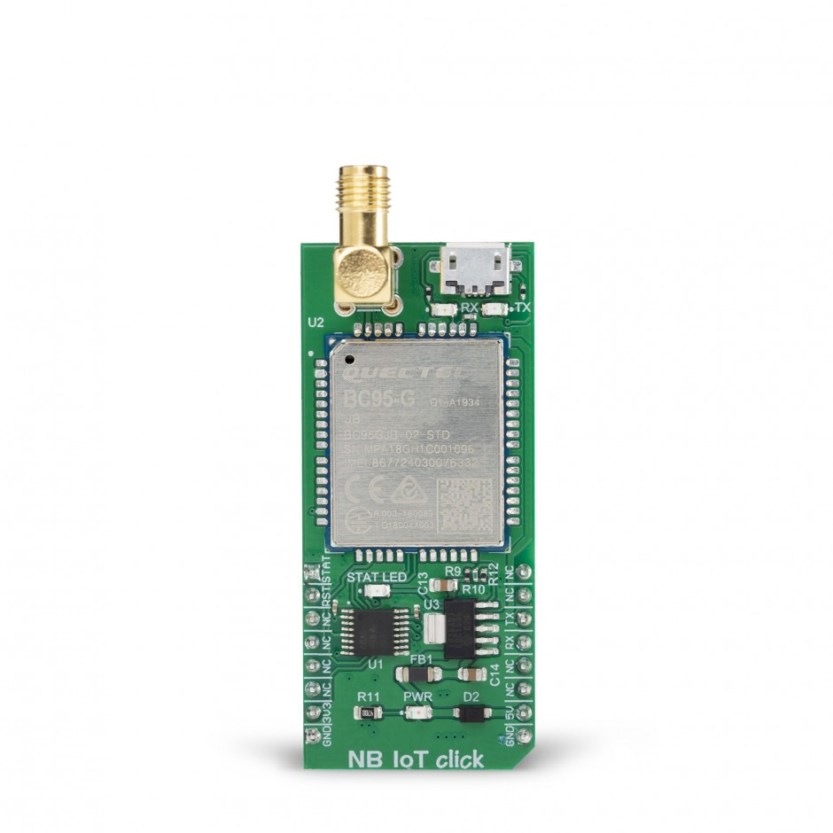

# C Library for NB-IoT

## Architectural Diagram

## Supported Devices
- [Quectel's BC95-G](https://www.mikroe.com/nb-iot-click)

## References

- Unit testing - [Unity](https://github.com/ThrowTheSwitch/Unity)

- Mocking - [C Mock](https://github.com/ThrowTheSwitch/CMock)

- Build system - [Ceedling](https://github.com/ThrowTheSwitch/Ceedling)
