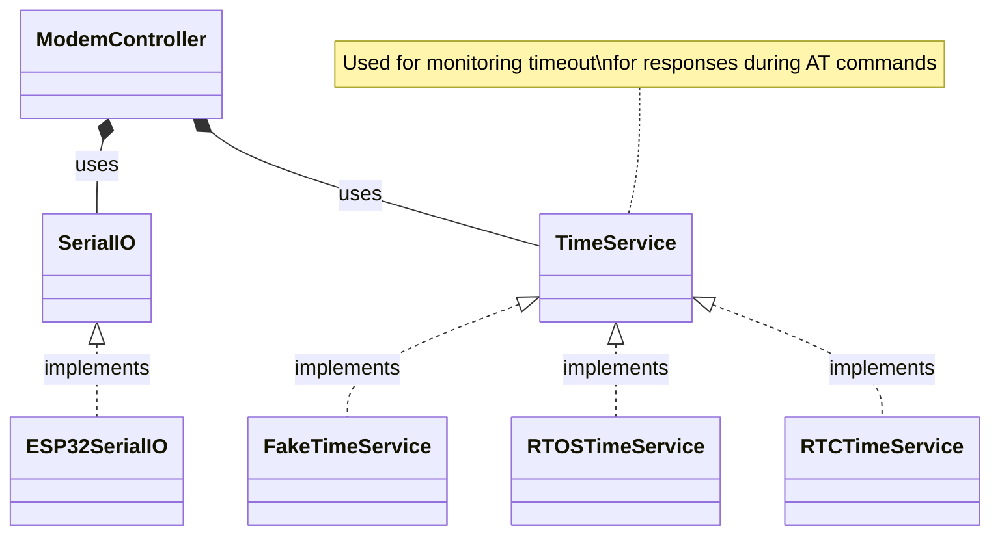

# Embedded C Library for NB-IoT


## Introduction

This package contains the Quectel's BC95-G, a high-performance NB-IoT module driver which supports multiple frequency bands (B1/B3/B8/B5/B20/B28).

The module has a built-in firmware that allows communication based on AT commands.

The entire driver is designed using mock objects and test driven development without the hardware.

## File Information
- ` Modem.h ` : This header file contains the declarations of the module's API
- ` SerialIO.h ` : This header file contains the interface of serial peripheral (UART). The user of this api must implement the interface in `SerialIO.c` file using their own low-level code or preferred HAL (Hardware Abstraction Layer). The interface acts as an adapter for the various HALs to the API.
- ` FakeTimeService.h` : This header contains the declarations of test doubles (fakes) to be used to simulate timeout during interaction testing
- ` TimeService.h ` : This header contains getMillis function which returns the elapsed time since the system bootup in terms of milliseconds. The user is given a choice to implement using their preferred time service (systick, timer, RTC, etc.)
- ` SubStringSearch.h ` : The header contains a function to find an first index of a substring inside the main string. This function is required to extract desired information from the module's response to the AT commands.
- ` mock_SerialIO.h `: The header contains the mock functions generated by CMock. This project uses ceedling as the build system to manage the tests and mocks generation.

## Architecture


## Supported Devices
- [Quectel's BC95-G](https://www.mikroe.com/nb-iot-click)

## Running The Tests
```
docker-compose up
```

## To Do
- [ ] Add examples using real hardwares

## References

- Unit testing - [Unity](https://github.com/ThrowTheSwitch/Unity)

- Mocking - [C Mock](https://github.com/ThrowTheSwitch/CMock)

- Build system - [Ceedling](https://github.com/ThrowTheSwitch/Ceedling)
