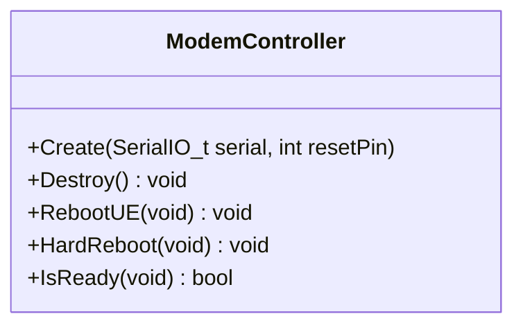

# Firmware Architecture & Test Cases

```mermaid
classDiagram
    class ModemController{
        +Create(SerialIO_t serial, int resetPin)
        +Destroy() void
        +RebootUE(void) void
        +HardReboot(void) void
        +IsReady(void) bool
    }

```