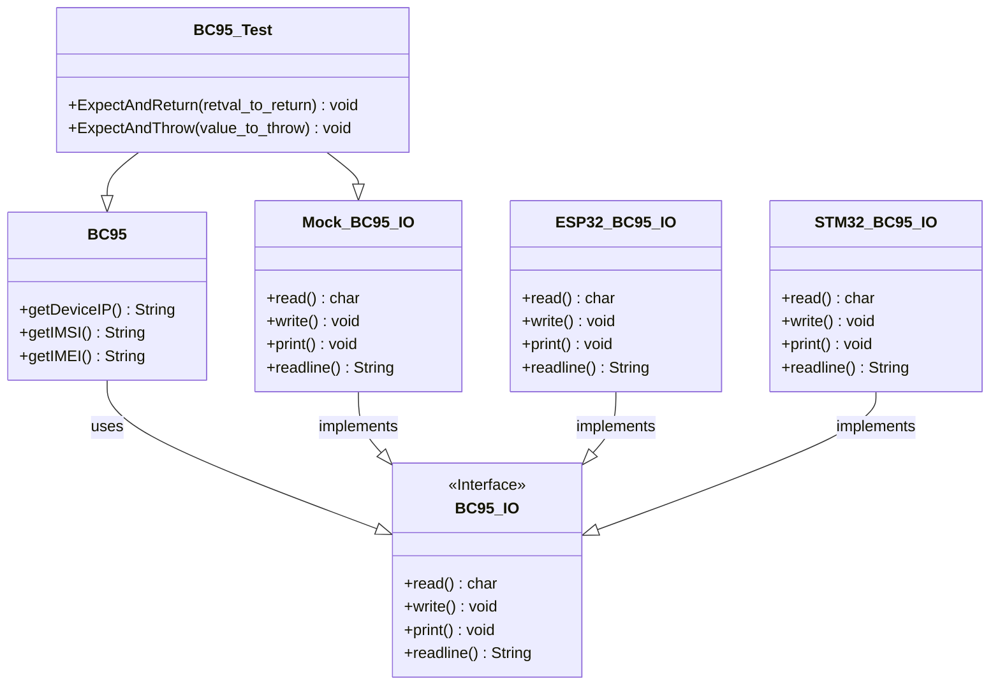

# Firmware Architecture & Test Cases

```mermaid
classDiagram

    BC95_Test --|> BC95
    BC95_Test --|> Mock_BC95_IO
    BC95 --|> BC95_IO : uses
    Mock_BC95_IO --|> BC95_IO : implements
    ESP32_BC95_IO --|> BC95_IO : implements
    STM32_BC95_IO --|> BC95_IO : implements
    class BC95{
        +getDeviceIP() String
        +getIMSI() String
        +getIMEI() String
    }
    class BC95_IO{
        <<Interface>>
        +read() char
        +write() void
        +print() void
        +readline() String
    }
    class Mock_BC95_IO{
        +read() char
        +write() void
        +print() void
        +readline() String
    }
    class ESP32_BC95_IO{
        +read() char
        +write() void
        +print() void
        +readline() String
    }
    class STM32_BC95_IO{
        +read() char
        +write() void
        +print() void
        +readline() String
    }
    class BC95_Test{
        +ExpectAndReturn(retval_to_return) void
        +ExpectAndThrow(value_to_throw) void
    }
```